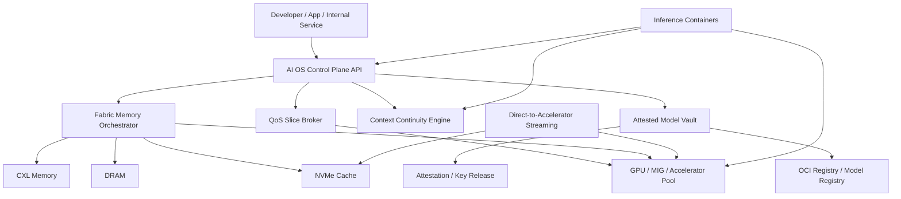

# AI特化Linux OS エンタープライズ製品仕様書

- 文書名: AI特化Linux OS エンタープライズ製品仕様書
- 版数: v2.0-draft
- 作成日: 2026-04-09
- 文書種別: 製品構想仕様書 / 買収検討向け上位設計書
- 対象読者: 事業開発、経営企画、M&A、OS基盤開発、プラットフォーム、セキュリティ、SRE

## 1. 要旨

本書は、単なる「AIが動くLinux」ではなく、大手企業が買収対象として評価しうる水準の、差別化されたAI実行OSの製品仕様を定義する。

本OSは、既存のLinux、GPUドライバ、コンテナ基盤、Confidential Computing、モデル署名技術を統合し、以下の価値を単一製品として提供することを目指す。

- AIワークロード専用のOS
- 企業向けの安全なモデル供給基盤
- 推論SLOを扱える制御プレーン
- モデル、メモリ、文脈、GPUスライスをOSレベルで扱う実行基盤

本書に含まれる独自機能は、2026-04-09時点で市場に広く完成形として存在していないが、既存の公開技術要素から現実的に積み上げ可能なものに限定している。以下の差別化機能は、公式ドキュメントに存在する個別要素から構成した製品レベルの推論である。

## 2. 買収検討に値する理由

### 2.1 何が普通のAIサーバーOSと違うか

一般的なAI実行環境は、以下のように分断されている。

- ドライバはベンダーごとに別管理
- 推論APIはアプリ単位でバラバラ
- モデル配布は単なるファイル配布
- セキュリティはホスト管理者を信用する前提
- メモリ制御はOSとランタイムで分断
- 更新時に文脈やKVキャッシュが失われる

本OSは、これらを1つの「AIインフラ製品」として統合する。

### 2.2 企業価値の源泉

- ドライバ、OS、コンテナ、AI推論を単一の運用モデルに統合できる
- セキュリティ、監査、署名済みモデル配布まで製品責任を持てる
- 推論SLOを「GPUの空き」ではなく「ビジネス優先度」で扱える
- 推論中の文脈をOS更新や障害から保護できる
- CXLやConfidential Computingのような次世代基盤を先に吸収できる

## 3. 製品ビジョン

本製品は、Linuxを「AIアプリの下請け基盤」から、「AIを中心に据えたオーケストレーションOS」へ拡張する。

コアビジョンは以下とする。

- モデルは単なるファイルではなく、証明付き資産として扱う
- メモリは単なるRAMではなく、AIデータ配置対象として扱う
- GPUは単なるデバイスではなく、SLOを持つ割当資源として扱う
- 文脈は単なるアプリ内状態ではなく、OS保護対象として扱う

## 4. 製品の主機能

本製品の主機能は以下の5つとする。

1. Fabric Memory Orchestrator
2. Attested Model Vault
3. QoS Slice Broker
4. Context Continuity Engine
5. Direct-to-Accelerator Streaming

## 5. システム全体像

## 6. 独自機能詳細

## 6.1 Fabric Memory Orchestrator

### 6.1.1 概要

Fabric Memory Orchestrator は、AIワークロードの主要データを `HBM/VRAM -> DRAM -> CXL -> NVMe` の階層に自動配置する制御機能である。

対象とするデータ種別:

- ベースモデル重み
- LoRA / Adapter
- KVキャッシュ
- RAGキャッシュ
- トークナイザおよび辞書
- 一時テンソル
- 再開用コンテキストスナップショット

### 6.1.2 なぜ重要か

現在のAI環境では、VRAM不足に対する対処はランタイム固有の工夫に依存しており、OSと統合された配置制御は限定的である。

本機能では、LinuxのDAMON、ページマイグレーション、HMM、CXLメモリ、PSI、OOM事前制御を組み合わせ、AI向けのメモリ自動運用層を定義する。

### 6.1.3 提供価値

- 大規模モデルの初回ロードを高速化する
- ホットなKVキャッシュを優先的に高帯域メモリへ保持する
- コールドな重みや過去文脈をCXLやNVMeに退避する
- メモリ圧迫時に「どのAIデータを落とすか」をアプリではなくOSが判断できる

### 6.1.4 主要仕様

- データ種別ごとに配置ポリシーを持つ
- アクセス頻度、再計算コスト、再取得コスト、SLO重要度を入力に優先度を算出する
- DAMONから得るアクセス傾向を利用する
- PSIとメモリ圧力を監視する
- CXLメモリ搭載機ではコールド領域の逃がし先として利用する
- 対応ハードウェアではHMMやページマイグレーションを利用する
- 再開可能な文脈はNVMeへスナップショット化する

### 6.1.5 未実現だが現実的な理由

個々の要素は既に存在する。

- DAMONによるアクセス観測
- Linuxのページマイグレーション
- HMMによるデバイスメモリ連携
- CXLメモリのLinuxサポート

ただし、これらをAIデータ分類とSLO入力をもつ統一制御プレーンとして製品化した例は限定的である。

## 6.2 Attested Model Vault

### 6.2.1 概要

Attested Model Vault は、モデルを単なるファイルとしてではなく、「署名され、必要なら暗号化され、真正なホスト上でのみ解錠可能な配布物」として扱う機能である。

### 6.2.2 主要機能

- モデルをOCI Artifactとして配布する
- Cosign等による署名検証を必須化できる
- SBOM添付を必須化できる
- モデル重みの暗号化配布に対応する
- ホストまたはワークロードの真正性確認後にのみ鍵を払い出す
- 規制業界向けに、特定TEE上でのみモデル利用を許可できる

### 6.2.3 価値

- モデル窃取耐性
- 社内配布と外部提供モデルの追跡
- 監査証跡の統一
- サプライチェーン証明

### 6.2.4 未実現だが現実的な理由

署名済みコンテナ、Confidential Containers、attestation、鍵配布は個別に存在する。しかし「AIモデル配布と実行許可」を一体化した運用OSはまだ十分成熟していない。

## 6.3 QoS Slice Broker

### 6.3.1 概要

QoS Slice Broker は、GPUを単なる共有資源ではなく、SLOを持つ予約資源として扱う機能である。

### 6.3.2 主な機能

- NVIDIA MIGや将来的な他ベンダー分割機能を抽象化する
- テナントごとに `latency / throughput / cost / isolation` の優先度を設定する
- GPUスライス予約、貸し出し、回収を制御する
- 予測負荷に基づいてキュー制御する
- p95レイテンシや最小tokens/secを満たすために admission control を行う

### 6.3.3 価値

- 社内横断のGPU共用をSRE運用可能にする
- 重要APIとバッチ推論を同居させやすくする
- テナント分離と性能予測性を高める

### 6.3.4 未実現だが現実的な理由

MIG自体は存在するが、AI推論SLOと接続したOSネイティブのブローカーは一般的ではない。製品化余地が大きい。

## 6.4 Context Continuity Engine

### 6.4.1 概要

Context Continuity Engine は、推論中のセッション状態やKVキャッシュをOSの保護対象として扱い、更新、再起動、フェイルオーバー時に再開可能にする機能である。

### 6.4.2 主な機能

- ドレイン時に文脈スナップショットを保存する
- 優先セッションだけを再開対象にできる
- 更新時に新バージョンへ文脈を引き継ぐ
- 期限切れ、ポリシー違反、暗号化不備の文脈を再開拒否できる

### 6.4.3 価値

- ゼロダウンタイムに近いAIサービス更新
- セッション切断率の低減
- 会話の長い業務支援システムに有利

### 6.4.4 未実現だが現実的な理由

ランタイム内部にはKVキャッシュ機能があるが、OS更新やテナント制御と結び付いた標準的な「文脈継続レイヤー」は未成熟である。

## 6.5 Direct-to-Accelerator Streaming

### 6.5.1 概要

Direct-to-Accelerator Streaming は、GPUDirect Storage などを活用し、NVMeや対応ストレージからGPUメモリへ直接モデルを流し込む高速ロード機能である。

### 6.5.2 主な機能

- 初回ロード高速化
- 低CPU負荷での大規模モデル展開
- 遅延ロードと段階的ウォームアップ
- レイヤ単位の先読み
- アダプタ差分の高速差し替え

### 6.5.3 価値

- モデル切替時間の短縮
- ノード再起動後の復旧時間短縮
- マルチモデル提供の運用性向上

### 6.5.4 未実現だが現実的な理由

GPUDirect Storageそのものは存在するが、OSレベルのモデル配布、署名検証、ウォームアップ、SLO制御までを統合した製品は限定的である。

## 7. 非機能要件

### 7.1 性能

- 初回モデル展開時間を現行コンテナ直接起動方式より短縮できること
- 同一モデル再起動時にキャッシュ再利用を優先すること
- 高優先度推論のp95レイテンシを維持すること

### 7.2 安定性

- OS更新時にロールバック可能であること
- GPUドライバ更新失敗時に前版復帰できること
- 推論コンテナ異常終了がホストOSを破壊しないこと

### 7.3 セキュリティ

- rootlessコンテナを標準とすること
- モデル署名検証を強制可能であること
- モデル暗号化と鍵解放ポリシーを持てること
- attestation要件をテナント単位で設定できること

### 7.4 観測可能性

- CPU、RAM、VRAM、CXL、I/O、温度、電力を収集可能であること
- 推論SLO、キュー長、tokens/sec、ロード時間を追跡できること
- OpenTelemetryベースで外部監視と接続できること

## 8. ターゲット顧客

- 金融、医療、製造など規制業界
- 社内にGPUを持つ大企業
- モデルを外部に持ち出したくない企業
- 複数事業部でGPUを安全共用したい企業
- 生成AIを内製基盤として持ちたいクラウド事業者

## 9. 競争優位の源泉

### 9.1 技術的モート

- OS層、ドライバ層、コンテナ層、推論層、セキュリティ層を横断している
- サプライチェーン保証と実行保証を接続している
- CXL、MIG、Confidential Computingの活用余地を先に製品化できる

### 9.2 データモート

- どのモデルが、どのTEEで、どの署名で、どのSLOで、どの文脈を処理したかを一元追跡できる
- これは企業の監査資産となる

### 9.3 運用モート

- 一度OSと制御プレーンが社内標準になると置き換えコストが高くなる
- M&A後に既存事業部へ横展開しやすい

## 10. 実装戦略

### 10.1 v1

- ImmutableベースOS
- Podman中心のAI実行基盤
- ローカルOpenAI互換API
- QoS Slice Brokerの基本実装
- モデル署名検証
- 監視ダッシュボード

### 10.2 v1.5

- Attested Model Vault
- Context Continuity Engine
- ルールベースのFabric Memory Orchestrator
- 規制業界向けポリシーセット

### 10.3 v2

- CXL優先のFabric最適化
- 負荷予測ベースのスライス再配置
- 文脈移送を伴う更新自動化
- マルチノード制御プレーン

## 11. 買収後の統合シナリオ

### 11.1 クラウド事業者が買う場合

- 既存GPUクラスタの高単価化
- 規制業界向け専用AI基盤商品化
- Confidential AIサービスへの展開

### 11.2 ハードウェア企業が買う場合

- 自社GPU/NPUの最適実行基盤として抱え込める
- 参照OSとして販売促進に使える

### 11.3 大手ソフトウェア企業が買う場合

- 社内AI基盤の標準化
- 既存業務アプリへの組み込み
- モデル配布、監査、SLO制御を統一できる

## 12. 成功指標

- 導入から初回推論までの平均時間
- モデル更新時の失敗率
- 高優先度推論のp95レイテンシ
- 署名/attestation違反の検出率
- GPU共用効率
- セッション再開成功率

## 13. 実装成果物

本仕様書に対応する初期実装成果物として、以下を定義する。

- Control Plane API 仕様
- Fabric Policy 宣言ファイル
- Attested Model Bundle 宣言ファイル
- Inference Service 宣言ファイル
- Tenant Class 宣言ファイル

これらの例は `docs/ai_os/` 配下に配置する。

## 14. 技術根拠

以下は、本仕様の実現可能性判断の基礎とした主な公開技術である。

- NVIDIA MIG
- NVIDIA GPUDirect Storage
- Linux DAMON
- Linux HMM
- Linux CXL
- Podman Quadlet
- Confidential Containers
- Sigstore / Cosign
- OpenTelemetry Collector

## 15. 参考リンク

- [NVIDIA MIG User Guide](https://docs.nvidia.com/datacenter/tesla/mig-user-guide/)
- [NVIDIA GPUDirect Storage](https://docs.nvidia.com/gpudirect-storage/)
- [Linux CXL documentation](https://docs.kernel.org/driver-api/cxl/index.html)
- [CXL Linux project documentation](https://cxl.docs.kernel.org/)
- [Linux DAMON documentation](https://docs.kernel.org/admin-guide/mm/damon/)
- [Linux HMM documentation](https://docs.kernel.org/6.7/mm/hmm.html)
- [Podman Quadlet](https://docs.podman.io/en/latest/markdown/podman-quadlet.1.html)
- [Confidential Containers overview](https://confidentialcontainers.org/docs/overview/)
- [Confidential Containers design overview](https://confidentialcontainers.org/docs/architecture/design-overview/)
- [Sigstore Cosign signing containers](https://docs.sigstore.dev/cosign/signing/signing_with_containers/)
- [OpenTelemetry Collector installation](https://opentelemetry.io/docs/collector/installation/)

## 16. 補足: 内蔵ローカル運用・軽量オーケストレーション

本製品が企業価値を持つためには、高度なセキュリティ機能やSLO制御だけでなく、「最初の1台で簡単に使えること」が重要である。

そのため、本製品は別途 `aiosd` と `aictl` を中心とした内蔵ローカル運用基盤を持つ前提とする。

この基盤の特徴は以下の通りである。

- 1台のワークステーションで即時起動できる
- 外部Kubernetesやetcdを必須にしない
- 同じ宣言ファイルを使って数台の小規模クラスターへ広げられる
- モデル、GPUスライス、文脈、キャッシュをAI向け資源として扱える
- レシピベースでPoCから本番前段階まで持っていける

これは単なる使いやすさ改善ではなく、買収後の展開速度に直結する。

- 事業部PoCを短期間で量産できる
- ローカル導入から部門標準へ段階的に広げやすい
- 高度なAttestationやModel Vault機能を後から載せやすい

詳細仕様は [LOCAL_ORCHESTRATION_SPEC.md](docs\ai_os\LOCAL_ORCHESTRATION_SPEC.md) を参照する。
